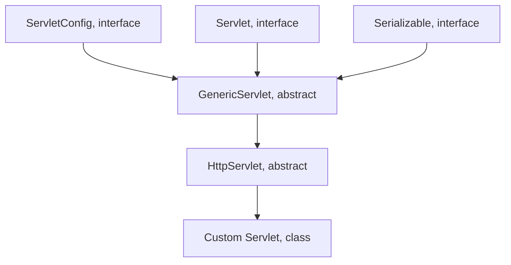

# Request

> 서버에 데이터를 요청하는 과정

자바는 객체지향 언어이기 때문에 리퀘스트 역시 객체로 만들어 관리

# Response

> Request에 대한 응답

자바는 리스폰스 역시 객체로 만들어 관리

# HttpServlet

서블릿을 만들 때 항상 HttpServlet 클래스를 상속받아야 함

프로토콜에 관한 모든 기능 포함

## HttpServletRequest의 주요 메소드

- getCookies() = 쿠키 가져오기
- getSession() = 세션정보 가져오기
- getAttribute(null) = 리퀘스트의 속성값 가져오기
- setAttribute(null, null) = 속성값 추가
- getParameter(null) = 폼에 데이터를 가져오기
- getParameterNames()
- getParameterValues()

# HttpServletResponse의 주요 메소드

- addCookie(null)
- getStatus()
- sendRedirect(null)
- getWriter()
- getOutputStream()
