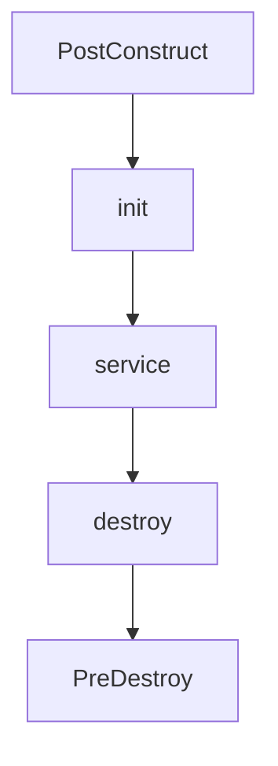

# Servlet Life-Cycle

서블릿은 사용자에 요청에 의해서 생성  
리스폰스를 반환하면서 소멸



- @PostConstruct
  - Servlet을 시작하기 전에 준비 단계
- init, service, destroy
  - Servlet 생성, 종료 단계
- @PreDestroy
  - destroy후 Servlet 정리 단계

각 단계를 Override나 정의해서 단계별 작업을 설정 가능

```
@PostConstruct
public void postConstruct(){

}

@Override
public void init() throws ServletException {

}

@Override
public void destroy() {

}

@PreDestroy
public void preDestroy(){

}
```

init - 로그인 ID 변수에 저장, 세션 확인 등의 작업  
destroy - 자원 반납 등의 작업
